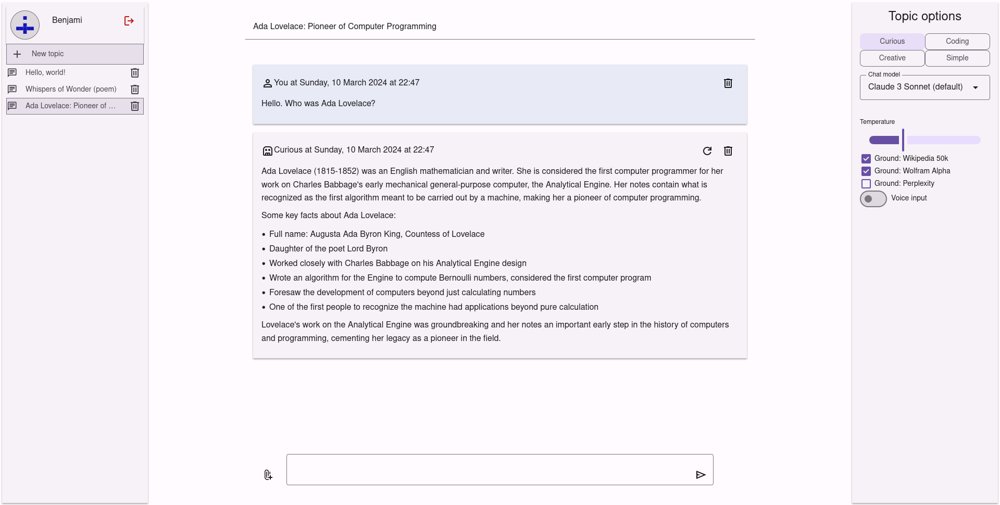

# engram
Engram is a chat bot interface powered by large language models (LLMs).
If you're familiar with ChatGPT, this shouldn't be too different.

I started this project to get some experience on working with LLMs;
later, I also realized that the work I had already done was (almost)
free university study credits. I still occasionally use Engram myself, but
realistically there is no reason why *you* should pick it instead of another
self-hosted LLM interface.

## Caveats
Before we begin, there are several limitations that you should be aware of:

* **English only** - even if the LLM shown in UI supports other languages,
  the underlying analyzation passes might not work!
* **Reliability of LLMs is what it is** - don't trust a word they generate!
* Engram relies heavily on external APIs - if they are unavailable, so is Engram
  * Some of leading LLM APIs have had rather *terrible* uptime in past
  * Usually, but not always, trying a different model will help
* There is currently no mobile support
* Voice interface is mostly proof of concept - latency is not great

## Usage


As you might expect, the basic user interface is similar to many existing chat
applications. You write your message (in text field at bottom); both your and
AI assistant's messages appear above that.

The panel at left contains a list of your topics. You can create new and
revisit (or delete) old conversations with AI assistants from there.
Each topic has its own message history and settings; there is currently no
cross-topic memory.

Speaking of settings, on left there is a panel with topic options.
Near top of it, you can choose the *engine* that drives the conversation.
In practice, each engine consists of an LLM but not only that:

* **Curious** has a built-in retrieval-augmented-generation system
  * That is, Engram provides the LLM grounding on factual data to avoid
    hallucinations; your mileage may vary on how successful this is
  * Sources: [Wikipedia level-5 vital articles](https://en.wikipedia.org/wiki/Category:Wikipedia_level-5_vital_articles)
     [Wolfram Alpha](https://www.wolframalpha.com/)
    and Perplexity's [online LLM](https://www.perplexity.ai/hub/blog/introducing-pplx-online-llms)
* **Coding** has a programming-oriented prompt and a language selector
* **Creative** has a customized prompt; nothing more than that
* **Simple** has no customizations (aside of a very short prompt)
  * This is good for trying out new models
  * Warning: some of the these models may be occasionally unavailable!

You can choose which LLM/model you use. The default option should work, but
beyond that it is also a matter of preference.

### Multimodal input
Engram supports image inputs, provided that the underlying model supports them.
Images can be attached to messages by dragging them on top of chat history, or
by using the button next the text field.


### Advanced: Keyboard shortcuts
Engram has a few keyboard shortcuts that can make common tasks faster:

* `Ctrl+Alt`: Starts a new topic
* `Ctrl+Space`: Focuses on the message field
* `Ctrl+1` to `Ctrl+4`: Changes the chat engine

## Usage (for developers)
For local development, you'll need the following:

* Node.js 20+ and npm
* Docker
* Linux (other operating systems *should* work, but are untested)

API keys and other secrets should be placed in `.env` file at repository
root. You'll have to create this yourself; see .env.sample for details.
Absolutely required options are:

* OpenAI access key
  * Title generation, and of course GPT-3.5 and GPT-4 models in chats
* [Together](https://www.together.ai/) API key
  * Various Mistral models are used for generating RAG search queries
* [Cohere](https://cohere.com/) API key
  * Used for reranking RAG documents
* [Anthropic](https://www.anthropic.com/) API key
  * All Claude 3 models
* OpenID Connect (OIDC) provider, if you want authentication
  * By default, authentication is disabled for local development
  * For testing OIDC or production usage, this is required!

Other keys are optional. Lack of them will make some non-default model options
not work and silently disable e.g. grounding in default chat, so don't do this
in production!

After `.env` has been configured, you can launch engram with:
```sh
npm ci # First time only, install dependencies
# npm install # Do this instead of above if you want to update package-lock.json
docker-compose up -d # Launch PostgreSQL development database
npm run all # Run backend and frontend
```

The frontend should now be automatically opened in your browser. If you see
nothing, wait a moment for the backend to stop and refresh the page.

Frontend has Vite hot reload enabled. Sometimes, this can break when CSS is
updated; in that case, just refresh the page. Backend automatically restarts
when it is modified, which usually takes a few seconds.

### Database migrations
Database schema is available at `backend/src/schema.ts`. After modifying it,
make sure to generate migration using `npm run migrations`. Migrations are
automatically run when the application starts, and should be committed to Git.

### Production deployment
Engram can be deployed to production as a container. To build an image, run
`docker-build.sh`. The script assumes write access to my container registry;
if you don't have that, you'll need to run the `docker build` by hand.
BuildKit is required; if it is not enabled by default for you, setting
`DOCKER_BUILDKIT=1` environment variable (not .env entry!) may help.

Although most data is saved in PostgreSQL database, attachments for multimodal
usage are currently stored in `/app/backend/attachments`. Be sure to mount
a volume to this directory to avoid data loss!

How the container is actually deployed is up to you. I use docker-compose and
a pile of custom code written with [Pyinfra](https://pyinfra.com/). A simple
compose file might look something like this:

```yml
version: '3.7'

services:
  database:
    image: postgres:15
    restart: unless-stopped
    environment:
      POSTGRES_USER: postgres
      POSTGRES_PASSWORD_FILE: /run/secrets/postgres-passwd
    volumes:
      - engram-db:/var/lib/postgresql/data
    secrets:
      - postgres-passwd
  app:
    image: ${DOCKER_REGISTRY}/engram
    restart: unless-stopped
    ports:
      - 3001:3001
    env_file: .env
    volumes:
      - attachments:/app/backend/attachments

volumes:
  engram-db:
  attachments:

secrets:
  postgres-passwd:
    file: secrets/postgres-passwd
```

## Architecture
Here is brief summary on how Engram has been built.

### Frontend
The frontend is built with TypeScript and Preact. State is managed globally
with Preact signals. Backend types are exposed via TS definitions generated
from OpenAPI spec, and (to lesser extent) by simply sharing code between
frontend and backend.

### Backend
Backend is written in TypeScript and uses Tsoa with Koa for serving HTTP
requests. An OpenAPI specification is automatically generated for the backend
API.

The backend uses Node.js APIs; though it might work with e.g. Bun, this has
not been tested.

### LLM providers and calls
Engram backend abstracts away the differences of LLMs for frontend as much
as possible. New LLM models and providers can be added relatively easily;
building a custom client from scratch is not the easiest thing, but connecting
to OpenAI-compatible API or integration an existing Node.js client is simple.

In general, all LLM responses are streamed. This applies both to backend
(which streams them from LLM providers) and frontend (which gets them from)
backend. In most cases, the streaming is done with server-sent events. there
is no persistent (WebSocket or otherwise) connection between the server
and client.

### Security
Engram uses OIDC authentication; this is implemented with passport. Once user
has successfully logged in, they are given a cryptographically signed
authentication token.

Most API routes are secured, meaning they require authentication to be usable.
Many of them also check if the current user should be allowed to access/modify
whatever data they requested. Guessing e.g. topic ids is easy; as such, they
are not relied for security.

Attachments are a notable exception. Knowing the name (random string) grants
read-only access to it.

### External tools
Engram supports two kinds of external tools for LLMs.

**Tool calling** is a feature supported by many leading LLM providers. With it,
the application provides a list of functions that the LLM is allowed to call.
The LLM does not actually call them; rather, instead of a textual response, it
may return a set of function call objects (containing function names and arguments).

Tool calls work reasonably well for actions. What they are not so great at is
information retrieval. As such, Engram currently barely uses them even though
a lot of time was spent to add support for them.

**Grounding** in Engram works somewhat differently. When user's message is
received, multiple LLMs are launched in parallel to generate various search
queries (or hypothetical answers) to it. Then, before any response is
generated, those queries are sent to various data sources such as:

* Vector search engines - a proof of concept of this uses Qdrant with Wikipedia
* Wolfram Alpha - an expert system, or something close to that
* Another LLM - preferably one with some grounding in place

This actually seems to work quite well.